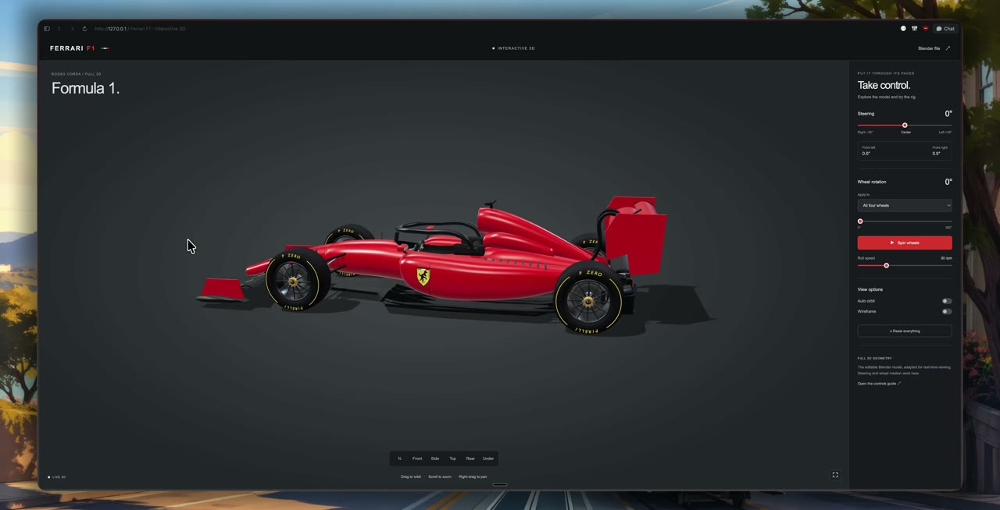

# Skills

A collection of independently installable skills for **Codex and Claude Code**.

| Skill | What it does |
| --- | --- |
| [canvas2imagegen](skills/canvas2imagegen/SKILL.md) | Takes you from a quick sketch to a generated image, using imagegen automatically in the same conversation. |
| [blndr](skills/blndr/SKILL.md) | Creates editable Blender models, with optional rigging and animation. |

## Install canvas2imagegen

Install it globally for Codex and Claude Code using the [Skills CLI](https://github.com/vercel-labs/skills):

```bash
npx skills add itssotsot/skills --skill canvas2imagegen --agent codex claude-code --global
```

## Use canvas2imagegen

1. Type `$canvas2imagegen` in Codex or `/canvas2imagegen` in Claude Code and describe the image you want.
2. Draw your reference in the canvas that opens, then click **Use sketch**.
3. The agent receives the drawing and uses **imagegen** with your original description. Refine the result in the same conversation.

For example:

> $canvas2imagegen I want a watercolor lighthouse on a rocky island. I'll sketch the composition.

The canvas fills the space below the toolbar and adapts to the window without stretching your artwork. It includes:

- Pen, eraser, fill bucket, line, rectangle, and ellipse tools.
- Color swatches, a custom color picker, and adjustable stroke size.
- Undo, redo, and undoable clearing.
- **Copy image** and **Download PNG**, exporting only the drawing on a white background.

You can attach an existing sketch to go straight to generation. Ask for just the canvas if you only need to draw or export a PNG.

### Requirements

The sketchpad needs Python 3 and a modern browser, with no account or build step. Image generation requires an available **imagegen** skill with a supported provider, or Codex's built-in image-generation tool. Installing canvas2imagegen alone does not add a generation provider.

**Use sketch** saves the PNG locally and hands it to the waiting agent. It requires an active skill invocation and cannot wake a completed turn or insert an attachment into the chat composer. Submitted PNGs stay in your workspace; unsent drafts stay in the open tab. Copy and download work independently of generation.

### Try the drawing app

To try it directly from this checkout:

```bash
python3 skills/canvas2imagegen/scripts/serve.py --open
```

That command opens the drawing-only app. Invoke the skill for the complete sketch-to-image flow.

[Read the full canvas2imagegen workflow →](skills/canvas2imagegen/SKILL.md)

## How blndr works

Describe what you want to create. The agent asks focused questions about missing details, uses your answers to identify any remaining gaps, and repeats until the requirements are clear. This covers appearance, required parts, intended use, movement, and deliverables. It builds on earlier answers rather than asking the same questions again.

Once those details are settled, the agent develops a concept and component references for your review. You can request changes and repeat the review until you approve them. Only then does modeling begin in Blender, followed by checks of the finished asset and its controls.

A local website opens before generation starts. Its **Assets** page fills as images and files are created. A separate **Interactive Preview** page becomes a 3D viewer when model geometry is available, with the agreed rig or animation controls.

[Read the full blndr workflow →](skills/blndr/SKILL.md)

## Install blndr

Install it globally for Codex and Claude Code using the [Skills CLI](https://github.com/vercel-labs/skills):

```bash
npx skills add itssotsot/skills --skill blndr --agent codex claude-code --global
```

## Use blndr

Type `$blndr` in Codex or `/blndr` in Claude Code, followed by your request.

## Examples

### Ferrari-inspired Formula One car

The starting request was:

> I want to create a red F1 Ferrari formula.

The agent clarified the delivery mode:

| Stage | Agent's question | User's answer |
| --- | --- | --- |
| Delivery mode | What should the Ferrari F1 model be prepared for? | Rigged model with steering and rotating wheels |

The options offered were:

1. Static display model with an editable `.blend` file (Recommended)
2. **Rigged model with steering and rotating wheels — selected**
3. Animated model—describe the motion you want

The result was an editable red Formula One car with front-wheel steering, independent wheel rotation, and a cockpit steering wheel that follows the front wheels. The project includes a gallery of generated concepts, component references, and model renders, plus an interactive 3D preview to orbit, zoom, steer, and spin the wheels.

[](assets/examples/ferrari-f1-demo.mp4)

[Watch the demo video (38 seconds)](assets/examples/ferrari-f1-demo.mp4).

## What you need for blndr

- Codex or Claude Code with local file and command access.
- Blender 4.5+ and Python 3.10+ with the [helper dependencies](skills/blndr/requirements.txt).
- Codex built-in image generation, or a configured OpenAI or Google Nano Banana API. API usage has separate costs; see [provider setup](skills/blndr/providers/README.md).

The generated files stay in your asset project folder.

[MIT License](LICENSE)
